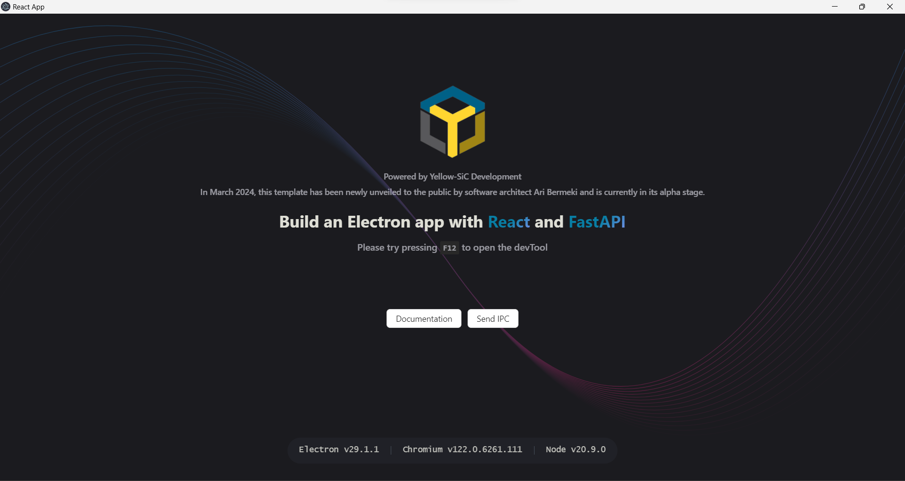

## 🔨 Usage

```bash
1-  git clone https://github.com/AriBermeki/electronfastapi.git
2- python -m venv venv  
3- . venv/Scripts/Activate.ps1 
4- pip install fastapi uvicorn websockets python-socketio  python-multipart anyio sqlmodel typer pyinstaller 
5- cd electronfastapi
6- npm i
7- npm start

```


## 📦 Build

```bash
npm run build:win
npm run build:mac
npm run build:linux

```
<div align="center">
    
</div>
